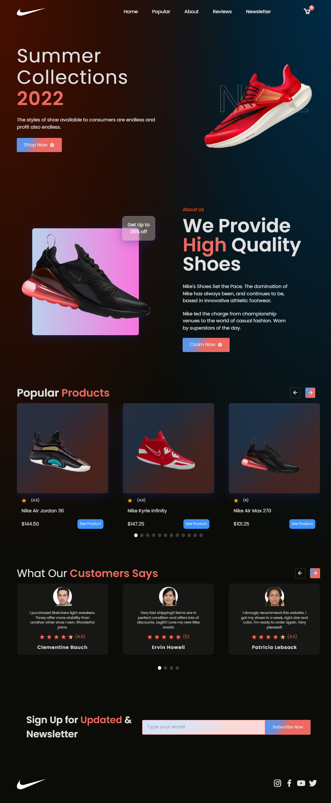

# Fullstack Nike Ecomemrce shop


## Run Locally

Clone the project

```bash
  git clone --depth=1 https://github.com/Soufianetyk1337/FullStack-Ecommerce-Website my-project
```

Go to the project directory

```bash
  cd my-project
```
Install all the dependencies
 ```bash
yarn install
 ```
Start the server

```bash
  yarn run dev 
```
Start Sanity Server:
```bash
cd sanity-cms && sanity start 
```
## Preview 


## Credits
Designer:
- [creativepeoplesdesign design on Dribbble](https://dribbble.com/shots/17237296-Shoe-Store-Ecommerce-Landing-Page)

Helpful ressources:
- https://www.sanity.io/blog/build-your-own-blog-with-sanity-and-next-js 
- https://www.sanity.io/docs/image-url 
- https://stripe.com/docs/checkout/quickstart
